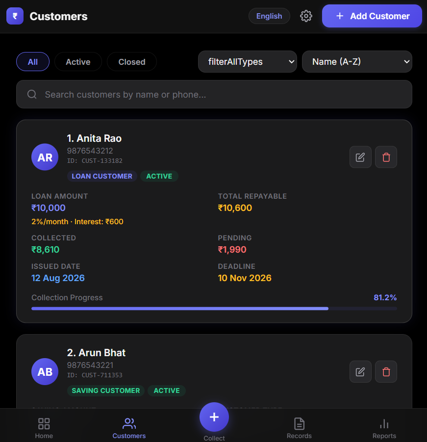
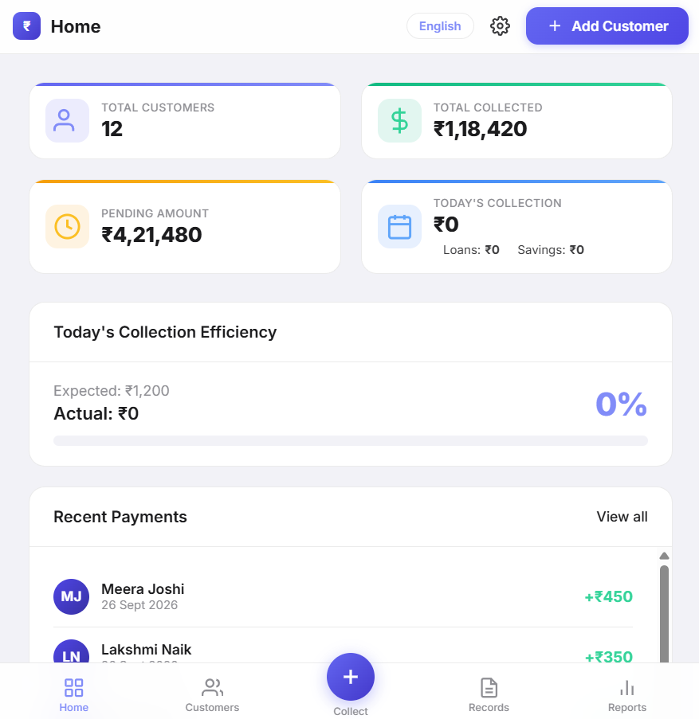
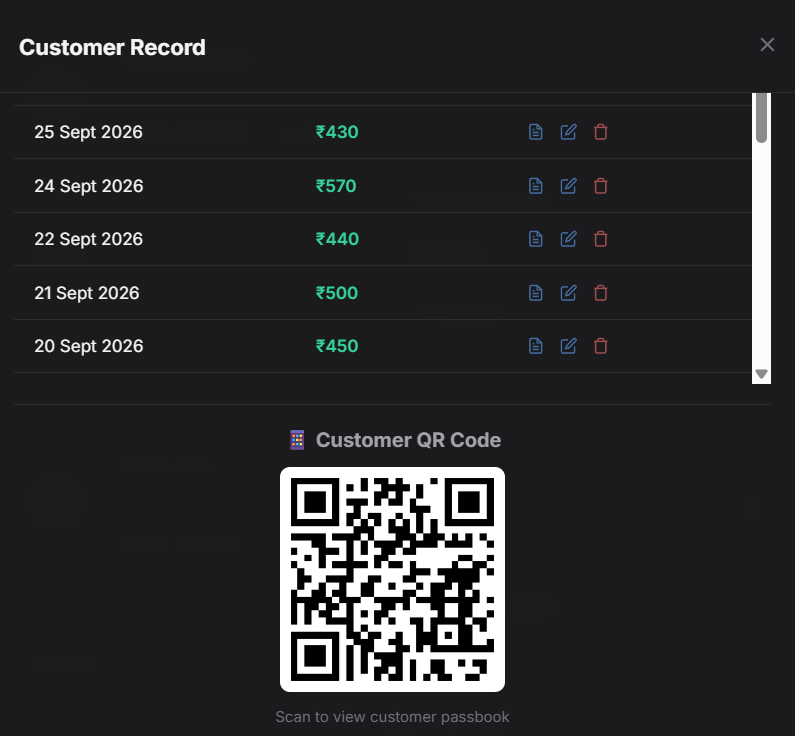
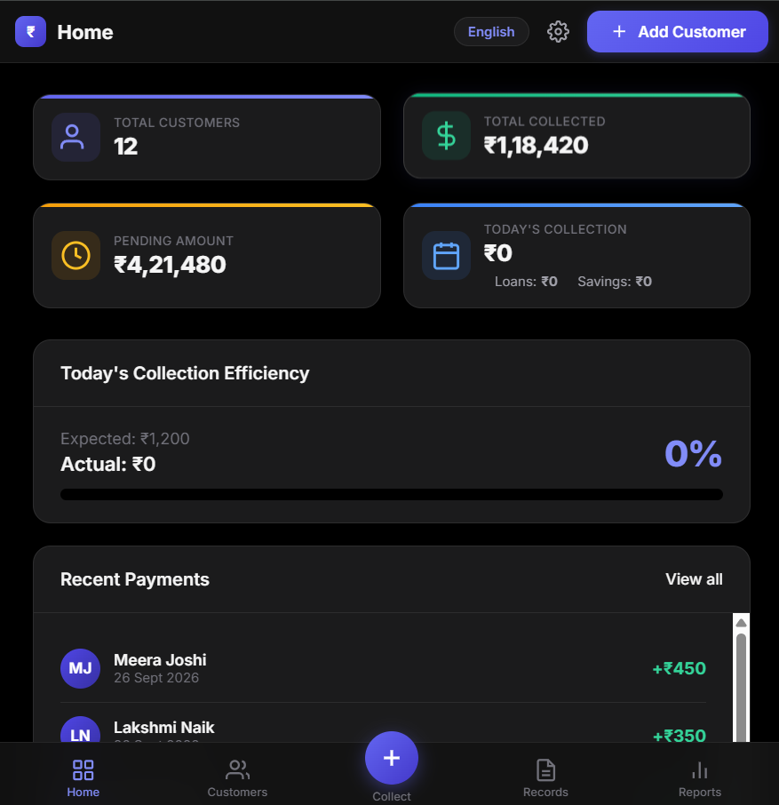
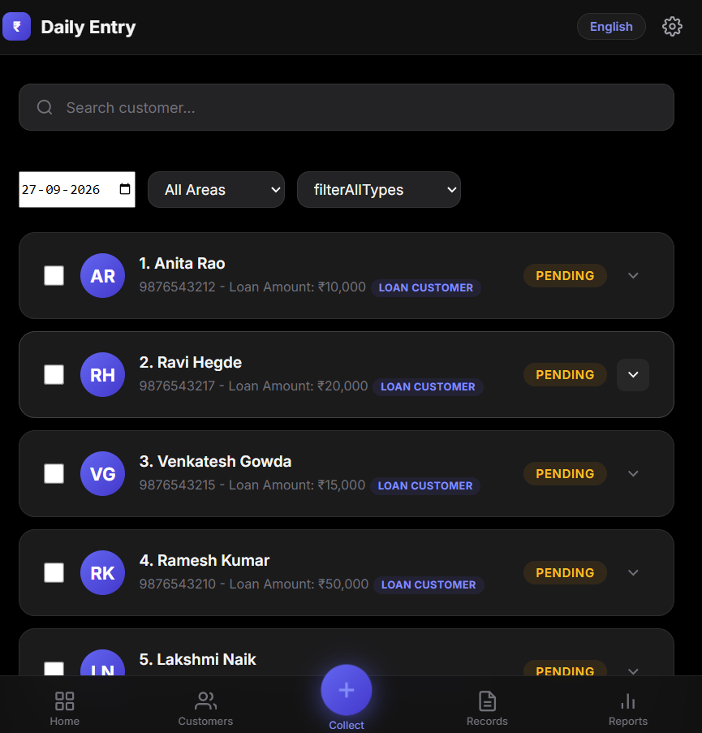

<div align="center">
  <h1>🐷 Pigmie (KhataFlow)</h1>
  <p><em>A modern, high-performance micro-finance collection tracking system</em></p>
  <p><strong>Offline-first • Multi-tenant • PWA + Android • Real-time Sync</strong></p>

  
  
  
  
</div>


---

**Pigmie (KhataFlow)** is a modern, high-performance financial record and collection management solution tailored for finance agents, daily micro-finance collectors, and loan management organizations. Designed with an offline-first architecture, multi-tenant cloud sync, and native Android support, Pigmie streamlines daily collections, payment audits, and loan passbooks.

---

### 🎮 Demo

Visit the live demo: [pigmie-web.pages.dev](https://pigmie-web.pages.dev)

**Personal Mode:** No login required — start tracking immediately  
**Organization Mode:** Sign in with Google to enable cloud sync  
**Customer Portal:** Use Org ID + Customer ID + PIN to view passbook

---

### 📸 Screenshots

| Personal Mode | Organization Mode | Customer Portal |
|:---:|:---:|:---:|
|  |  |  |

| Dashboard View | Daily Entry View | Dark Mode View | Android APK View |
|:---:|:---:|:---:|:---:|
|  |  |  |  |

---

## ✨ What Makes This Special

* **Offline-first architecture** with automatic cloud sync
* **3 operating modes** (Personal, Organization, Customer Portal)
* **Multi-language support** (English, Kannada, Hindi)
* **Real-time collaborative data** with Firebase listeners
* **RBAC** with 6 granular roles
* **PWA + Native Android** from one codebase
* **Dark mode + AMOLED true black** theme
* **Financial analytics** with Chart.js
* **Approval workflow** for ledger integrity
* **CSV/PDF export capabilities**

---

## 🏗️ Architecture

```text
Browser (PWA) ──> IndexedDB (Offline) ──> Firebase Firestore (Cloud Sync)
                                      ──> Firebase Auth (Google Sign-In)
                                      ──> Capacitor ──> Android APK
```

---

## 🌟 Key Features

### 🔄 Dual Operating Modes
* **Personal Mode (Offline-First):** Built for independent agents. Leverages browser **IndexedDB** for zero-latency local operations without needing an internet connection. Includes optional manual or scheduled auto-backup to Firebase cloud storage.
* **Organization Mode (Real-Time Cloud Sync):** Built for multi-agent teams. Connects directly to **Firebase Firestore** with real-time listeners for live collaborative updates and strict cache collision avoidance.

### 🛂 Granular Role-Based Access Control (RBAC)
Configurable permission matrices (`permissions.js`) govern access based on organizational roles:
* **👑 Owner / Admin:** Full control over organization settings, member invitations, role assignments, audit logs, and approval queues.
* **👔 Manager:** Access to org-wide dashboards, agent performance reports, customer assignments, and approval workflows.
* **🚶 Agent / Collector:** Operational view restricted to assigned customers and payments. Sensitive modifications are queued for managerial approval.
* **👁️ Viewer / Auditor:** Read-only compliance access across all financial ledgers.

### 🛡️ Secure Approval Workflow
To guarantee ledger integrity, actions initiated by restricted roles (e.g., adding customers, deleting payments, closing loans) are submitted to a **Pending Approvals** queue. Admins and Managers review and approve or reject changes before they are committed to Firestore.

### 📖 Customer Self-Service Portal
A standalone passbook interface allows end-customers to securely track their payment history, total loans, and remaining balance using their unique **Organization ID** and **Customer ID**.

### 🔒 Native Android & Biometric Security
* Integrated with **Capacitor 8** for native Android deployment (`.apk`).
* Touch ID / Face ID biometric authentication support powered by `@capgo/capacitor-native-biometric`.

### 📊 Dashboard & Financial Analytics
* Real-time metrics for total capital, daily collections, pending dues, and active loans.
* Visual analytics powered by **Chart.js**.
* Automated identification and reporting of top defaulters based on payment velocity.

### 🌐 Multi-Language Typography
Native typography support for multi-regional deployment, including **Devanagari** and **Kannada** font families alongside standard Inter typography.

---

## 🛠️ Technology Stack


---

## 📁 Repository Structure

```text
Finance/
├── index.html                   # Core web application markup & onboarding screens
├── app.html                     # App entry (mirrors index.html)
├── styles.css                   # Global styling system, dark mode, responsive layouts
├── app.js                       # Primary application state, IndexedDB engine & offline sync
├── sync.js                      # Firebase Auth state controller & mode switching logic
├── org.js                       # Organization mode Firestore listeners & multi-user sync
├── permissions.js               # Centralized RBAC matrix and authorization rules
├── customer-portal.js           # Self-service customer passbook verification logic
├── audit.js                     # Activity logging and audit trail system
├── firebase-config.example.js   # Firebase setup template (copy to firebase-config.js)
├── firestore.rules              # Firebase Security Rules for database protection
├── manifest.json                # Web App Manifest for PWA installation
├── capacitor.config.json        # Native mobile build configuration
├── landing/                     # Marketing website pages
│   ├── index.html               # Landing page with hero, features overview
│   ├── features.html            # Detailed features breakdown
│   ├── pricing.html             # Pricing tiers
│   ├── security.html            # Security & compliance info
│   ├── portal.html              # Customer portal entry
│   ├── contact.html             # Contact form
│   ├── solo.html                # Solo agent landing
│   └── teams.html               # Teams/org landing
├── scripts/
│   ├── serve.js                 # Lightweight Node.js local development server
│   ├── sync-web.js              # Build script to copy web assets to dist directory (www/)
│   └── seed-demo-data.js        # Demo data seeder (paste in browser console)
├── screenshots/                 # App screenshots for README & project report
└── android/                     # Native Android project directory (Gradle)
```

---

## 🚀 Getting Started

### Prerequisites
* **Node.js** (v16.0.0 or higher) & **npm**
* **Firebase Project** with Firestore and Authentication enabled
* **Android Studio & SDK** (Only required for building Android APKs)

---

### 💻 Web Development Setup

1. **Clone the repository:**
   ```bash
   git clone <repository-url>
   cd Finance
   ```

2. **Configure Firebase:**
   Copy the example template and fill in your Firebase credentials:
   ```bash
   cp firebase-config.example.js firebase-config.js
   ```
   *Edit `firebase-config.js` with your Firebase Console credentials (`apiKey`, `projectId`, `authDomain`, etc.).*

3. **Install Dependencies:**
   ```bash
   npm install
   ```

4. **Run Development Server:**
   ```bash
   npm run web
   ```
   Open your browser at **`http://localhost:8080`**.

---

### 📱 Android Application Setup (Capacitor)

1. **Synchronize Web Assets:**
   ```bash
   npm run android:sync
   ```

2. **Open in Android Studio:**
   ```bash
   npm run android:open
   ```

3. **Build Debug APK via CLI:**
   ```bash
   npm run android:build
   ```
   The compiled APK will be located at:
   `android/app/build/outputs/apk/debug/app-debug.apk`

---

## 📜 NPM Scripts Reference

| Command | Description |
| :--- | :--- |
| `npm run web` | Launches the local Node.js web server (`scripts/serve.js`) |
| `npm run sync:web` | Bundles and syncs web root assets to the `www/` directory |
| `npm run android:add` | Initializes the Capacitor Android platform directory |
| `npm run android:sync` | Syncs web assets and updates Capacitor Android plugins |
| `npm run android:open` | Opens the native Android project in Android Studio |
| `npm run android:build` | Compiles the Android project into a debug APK (`app-debug.apk`) |

---

## 🔒 Database Security

Ensure your Firestore database rules are configured using `firestore.rules`. Key rules include:
* **Customers & Payments:** Read access granted to organization members; write access guarded by role permissions and approval requirements.
* **Customer Passbook Public Lookup:** Read-only access enabled for passbook lookups matching specific `orgId` and `customerId`.

---

## 🔮 Future Scope / Production Roadmap

> A production-grade architecture has been designed using React 18, NestJS, PostgreSQL with Row-Level Security, and Supabase for multi-tenant SaaS deployment. See the [Engineering Documentation Set](New%20folder/) for complete specifications.

* **Migration to React + TypeScript frontend**
* **NestJS REST API backend with Prisma ORM**
* **PostgreSQL with Row-Level Security** for multi-tenant isolation
* **TOTP-based Two-Factor Authentication**
* **Automated CI/CD** with GitHub Actions
* **Geo-tagged and photo-verified collections**

---

## 🤝 Contributing

Contributions, issues, and feature requests are welcome!
Feel free to check the [issues page](../../issues).

---

## 🧑‍💻 Author

Built by a final year engineering student.

---

## 📄 License

This project is private software licensed under the **ISC License**.
